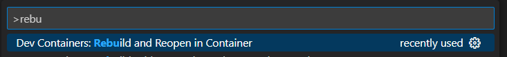

# [Github Pages] with [Jekyll]


## Before Get Start

Make sure if you installed "VS Code" and "Docker Engine"

> [Visual Studio Code]
>
> [Docker Engine] *(IF Windows, recommend to install [WSL 2] to use as a base engine for better performance)*


## How to Use

1. Clone repository
```bash
$ git clone https://github.com/who0joe/who0joe.github.io.git
```

2. Run VS-Code and Open who0joe.github.io folder on VS Code

3. Run devcontainer envirnoment: "ctrl + shift + P" and, type "rebuild" to execute "Remote-Containers: Rebuild and Reopen in Container"

<space><space><space><space>

<space> 

4. execute `bundle` to generate Gemfile.lock for required dependencies
```
$ bundle
```

5. run `jekyll serve`, after build finished you can see the site at http://localhost:4000
```
$ jekyll serve
```


---

***This site uses Just the Docs, a documentation theme for Jekyll.*** 

*for more information please check followings*

> [Github Pages]
>
> [GitHub Docs for Github Pages]
>
> [Jekyll]
>
> [Just the Docs Github]
>
> [just-the-docs-template]


---
[Visual Studio Code]: https://code.visualstudio.com/
[Docker Engine]: https://www.docker.com/products/docker-desktop/
[WSL 2]: https://learn.microsoft.com/ko-kr/windows/wsl/install

[devcontainer]: https://containers.dev/
[Github Pages]: https://pages.github.com/
[GitHub Docs for Github Pages]: https://docs.github.com/en/pages
[Jekyll]: https://jekyllrb.com
[Just the Docs]: https://just-the-docs.github.io/just-the-docs/
[Just the Docs Github]: https://github.com/just-the-docs/just-the-docs
[just-the-docs-template]: https://github.com/just-the-docs/just-the-docs-template/generate


